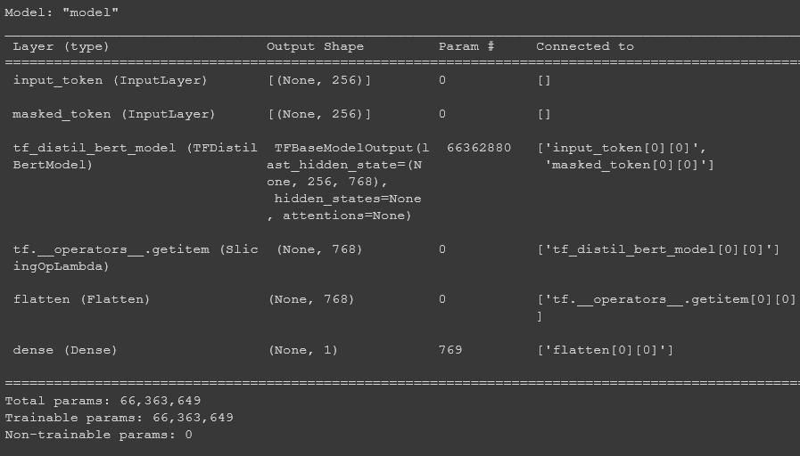
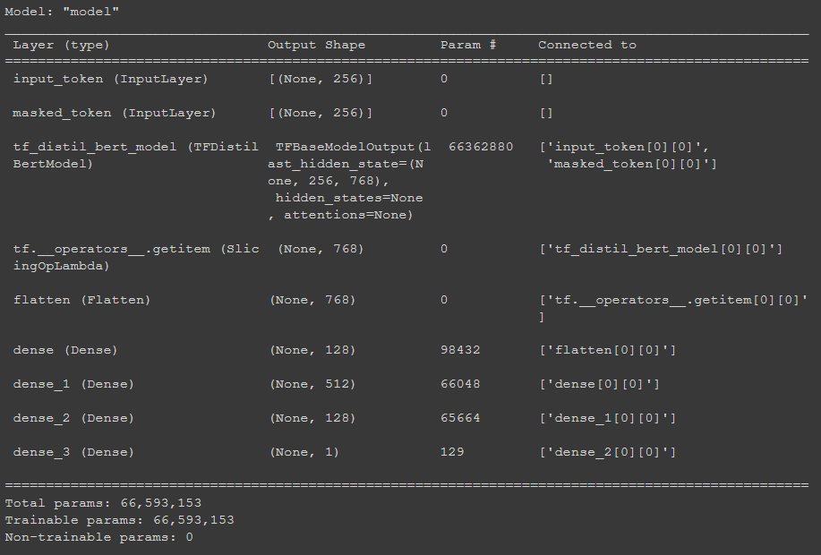
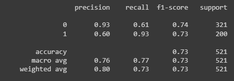
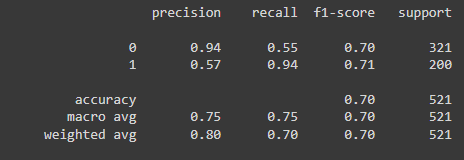

# Definition 

The word "Appreciation" is used in Finance mostly in English (meaning an increase in value). We will refer from now to appreciation as GRATITUDE.
The retained definition is [here](https://docs.google.com/document/d/1cBk7Vwj0HXQSu9wpw2S2NnIIOGs5911D_P5RKkh-T_0/edit?usp=sharing)

**Definition of gratitude:**

> warmly or deeply appreciative of kindness or benefits received previously from someone/entity (being just thankful as pleasant to the mind or the senses will NOT be marked as gratitude)
> ALSO any intent of recognizing or showing gratitude (directly by speaker or indirectly ) that someone (understood as entity/person) is valuable, important.
> MUST BE showing or expressing thanks to someone that has to be specific (Mention of a user, named entity). Generic entities like “you”, “mother”, “father”, “god”, “lord”,”life”, “blessing” will not be considered as gratitude valuable for clients.
> Wishing thanks or thanking in advance for a request will NOT be considered as gratitude. 

# Bibliography

Our research of *Appreciation* bibliography yielded findings that revolve around emotion (mainly negative: Depression, suicidal tendencies) analysis in general. 
However, we sensed some difficulties in differenciating between the intent of *Appreciation* and *Sarcasm* in some documents, we believe that we can bootstrap sarcasm detection tools along with our models to overcome the confusion. Some of the most recent research about sarcasm detection:
* [**Sarcasm Detection Technique on Twitter Data with Natural Language Processing**](https://link.springer.com/chapter/10.1007/978-981-15-8377-3_24)
* [**Detection of Sarcasm on Amazon Product Reviews using Machine Learning Algorithms under Sentiment Analysis**](https://ieeexplore.ieee.org/abstract/document/9419432) 
* [**Twitter review analysis and sarcasm detection**](https://fcihib.journals.ekb.eg/article_107520_12573956b1fb6b66363cf54c25ca0e85.pdf)
  
We also found the following research [**Application of Automated Text Analysis to Examine Emotions Expressed in Online Support Groups for Quitting Smoking**](https://www.journals.uchicago.edu/doi/pdf/10.1086/714517). This research is based on:
> The emotional expressions in 1 month of posts by members of 36 online support groups [that] were related to abstinence at month end. 

In this research:
> ..., posts were scored for overall positive emotions, overall negative emotions, anxiety, anger, sadness, and an upbeat emotional tone. Greater expressions of negative emotions, and specifically anxiety, related to nonabstinence, while a more upbeat emotional tone related to abstinence.
We believe we can leverage from their dataset as well as the approach they follow to obtain a better understanding of features related to upbeat emotional tones that certainly include emotions of *Gratitude* and *Appreciation*.  

# Dataset

## Dev & Test datasets

| Set | Spreadsheet | Number of Gratitude Tweets | Number of No gratitude Tweets |
|:---:|:-----------:|:--------------------------:|:-----------------------------:|
|Test |   [link](https://docs.google.com/spreadsheets/d/11Ic1CUc8Pxlhi4hlURzrBw8imvPaCYgaSAFp4i5fJ44/edit?usp=sharing)  |             202            |           323                 |
|Dev  |   [link](https://docs.google.com/spreadsheets/d/1lMyoKZU9snl2MPVRvlBZglw1ARR9DE2SoFLXTril61s/edit?usp=sharing)  |             232            |           298                 |

## Training dataset

| Spreadsheet | Number of Gratitude Tweets | Number of No gratitude Tweets |
|:-----------:|:--------------------------:|:-----------------------------:|
|   [link](https://docs.google.com/spreadsheets/d/18U1itio71HQJ0m3LdmTB-ARE36eTlcEDklz2362EVaU/edit?usp=sharing)  |             8275            |           8492                 |

# Analysis

## Baseline

### English

* **Patterns:**
  * thank - (?:god|lord)
  * I/we - appreciate/congratulate/owe/value/treasure/acknowledge/...
  * you - be - the - best/greatest/swetest/...
  * very/extremely/truly/... - grateful/thankful/...
  * I/we - be - thankful/indebted/...
  * good/amazing/excellent/... - work/job/initiative/...
  * I/we - truly/really/deeply/... - like/appreciate/owe/recognize/...
  * kind/sweet/thougtful/... - of - you
  * express - our/my - gratitude/acknowledgment/appreciativeness/...
  * how - grateful/thankful/... - I/we - b
  * I'm/we're - very/so/... - grateful/thankful/...
  * you - rock

| Set | Precision | Recall | F1  | TPs | TNs | FPs | FNs |
|:---:|:---------:|:------:|:---:|:---:|:---:|:---:|:---:|
|Test |   0.809   | 0.826  |0.811|174  |251  |70   |26   | 

* Analysis:
   
  * False Positives occur in implicit request-Gratitude. Meaning when users thank customer service (**e.g.** "USER That's very kind of you, but this was a while back. Amazon already fixed the issue, even though it wasn't their fault the delivery went to the wrong house. :)", "USER You’re very kind, but it’s 9:32pm&amp;I need to relax. I’ll be happy to connect tomorrow through DM. Can’t say your CS isn’t prompt! Thank you.") and irony (**e.g.** "Shout out to USER for lying to me about my plan, when trying to get it fixed telling me there is nothing to do about it and to this day having the worst customer service out there. You're the best. :)") 
  
  * False Negatives occur when the gratitude expression isn't preceeded by a pronoun (**e.g** "USER Appreciate it. We love USER and only want to see her succeed in the future... so appreciate you letting me be your (somewhat worried) canary in the coal mine ;)", "USER So punny;) I ❤️ you, Southwest. Thankful for you today especially!!! BestAirlineEver") and implicit gratitude (**e.g.** "USER 16:30 Birmingham to London Euston, the very kind staff at the shop are trying to sort something out") 

### French

* With the French baseline, we started with a lower recall than the English baseline. We noticed that common expressions of *Gratitude* needed several patterns to be captured as opposed to English expressions, where most of them are captured with one pattern.  The Conjugation of verbs to match the social context of the dialogue and the common courtesy expressions "formules de politesse" lead to a combination of tokens (number and position) that varies but to capture what is basically the same sentence. 

* **Patterns:**
  
  * je/nous/on - vous/te/les/le/la - remercier
  * je/nous/on - vous/te/les/le/la - en - remercier
  * je/nous/on - remercier
  * je/nous/on - tenir - à - vous/te/les/le/la - remercier
  * je/nous/on - tenir - à - remercier
  * merci - beaucoup
  * nos/mes - sincères/... - remerciments/... 
  * no/mes - remerciments
  * nous/je/on - vouloir - vous/te/les/le/la - remercier
  * merci
  * remerciments - adressés - à
  * j'/nous/on - apprécier - votre/vos/ta/tes/ton/sa/son/leur/leurs - générosité/...
  * remerciement/... - adresser - à
  * je/nous/on - ne - savoir - pas - comment - vous/te/les/le/la - remercier
  * je/nous/on - savoir - pas - comment - vous/te/les/le/la - remercier
  * je/nous/on - aimer/vouloir/... - remercier
  * je/nous/on - vous/leur/te/... - être - toujours/... - reconnaissant
  * je/nous/on - vous/leur/te/... - être - reconnaissant
  * je/nous/on - être - reconnaissant
  * je/nous/on - être - super/... - reconnaissant
  * remerciement - éternel/... - à

Working with a [dev set](https://docs.google.com/spreadsheets/d/1LP6IxhE2pA2S2GazN6VRzXdj_iE7a5v7zInR-s93UHo/edit?usp=sharing) of 423 examples (132 *Gratitude* and 291 *non-Gratitude* tweets)

|Iteration| Set | Precision | Recall | F1  | TPs | TNs | FPs | FNs |
|:-------:|:---:|:---------:|:------:|:---:|:---:|:---:|:---:|:---:|
|   1     |Dev  |   0.809   | 0.813  |0.811|99   |255  |36   |33   |

* Analysis:
  * False Positives are mostly expressions of gratitude that don't fit our working definition (**e.g** "je vis mon rêve tous les jours c’est incroyable je suis tellement reconnaissante", "USER Je la remercie", "Chaque jour qui passe je suis reconnaissante de ne pas être un homme blanc qui porte un sac à dos Decathlon avec son costume Celio") and request-*Gratitude* (**e.g.** "USER Bonjour, je cherche à vous joindre. Peut-on échanger en DM ? Merci à vous", "Nous nous excusons de la gêne occasionnée, Merci de votre compréhension."USER Bonjour de nouveau! Merci de partager ce grand fou!")
  * False Negatives contain many examples that are successfully captured in a self-contained environment but fail to be captured by the current pipeline (**e.g.** "Remerciements adressés à USER par tous ceux qui ont pris la parole", "Nous tenons à remercier USER pour sa contribution.", "Nos sincères remerciements aux agents"). There are, also, irregular expressions of *Gratitude* (**e.g** "Je crois que l’ont peut remercier M Barnier candidats LR à la présidentielle pour la qualité des accords", "Honoré et reconnaissant d'être le lauréat 2021 du Prix de la ministre de la Sécurité publique du Québec.", "Nos plus vifs remerciements à USER pour votre accueil de la délégation de chefs d'établissement tunisiens", "beaucoup de gens vous sont reconnaissants")

### Arabic 

* With the Arabic baseline, we struggled with aquiring data to construct a ~ 400 examples dev set. The main issues we faced were the following:
  * Tweepy does not support query flags with Arabic keywords. Without the `-filter:retweets` flag, we end up with a ~ 70% retweets in the dataframe that contain little to no *Gratitude* tweets. 
  * The current available Arabic data (4169 rows) is unlabeled and it contains tweets from Iraq, Yemen, Morocco and Jordan. Running a quick search with the following regex (containing the most basic *Gratitude* voabulary that is most likely to be common amongst most of the dialect) **(شكرا|متشكر|مشكور|أشكر|نشكر|متشكرة|متشكرين|ممتنين|ممتن|ممتنة|شكر|الشكر)** yields 244 rows containing a large number of tweets expressing religious gratitude and other forms that don't fit the working definition. 
* Another issue we faced with the Arabic baseline is the extreme difference between the spoken Arabic dialects. Writing patterns using the original *Fus'ha* Arabic will not generalize well on real Arabic data (It is also very common to find Latin words in Arabic texts that refer to tech related concepts or popular topics at the moment). The best way to proceed, in our opinion, is to rely on a diverse set with various dialects to write patterns that capture the most common expressions through all of the dialects.  
* Furthermore, religious vocabulary is more common whithin the Arabic language than it is within the English language. Contrarily to our current working definition, a person might be expressing their *Gratitude* to someone or for a tangible thing through prayer or through thanking the lord. 
  
## TextCat

### Results

| Set | Precision | Recall | F1  | TPs | TNs | FPs | FNs |
|:---:|:---------:|:------:|:---:|:---:|:---:|:---:|:---:|
|Test |   0.685   | 0.654  |0.587|184  |125  |196  |16   | 

We managed to improve the classifier's results on the dev set (**P:0.888, R:0.885, Macro_F1:0.886 -> P:0.894, R:0.895, Macro_F1:0.894**) but we notice a significate decline of the results on the test set (**P:0.754, R:0.768, Macro_F1: 0.755 -> P:0.685, R:0.654, Macro_F1:0.587**). Therefore, we will analyze the errors for each set separately. 

* Test set analysis:
  * False Negatives are mostly phrases where the user expresses *Gratitude* without the use of "I" or "we" pronouns or implicit expressions of *Gratitude* (**e.g.**"I woke up to a gift from USER on the first day of my 44th trip around the sun 🥰 grateful Phish love	", "Really lucky to have such a kind and thoughtful son USER ... a surprise delivery this morning and a much needed calorie boost. Question is, which one should be eaten first? thoughtful grateful howlongwilltheylast"). We also notice that some generic examples that used to be captured are now being missed by the classifier (**e.g.** "USER USER This is very nice of you. 😁 GoodDeeds Kindness Thoughtful", "USER : Extremely grateful to USER and the Snow family for enabling me to go beyond the 3-yr grant cycle and develop a t…").
  * False Positives are, **still**, expressions of *Gratitude* that don't fit our working definition (**e.g.** "thankful to be on the Indigenous land that my Immigrant family felt would afford us a better life from the Caribbean.", "Yesterday, Today, Tomorrow, Every Day Thankful", "It was during the last happySunday, October17, just before WorldMenopauseDay that USER became a follower on socialnetworks. I hope not to disappoint on issues of prevention and womenshealth. We seek the best healthcare. Many Thanks"). We, also, notice that there are no apparent irony examples like the ones from the previous iteration.

* Dev set analysis: 
  * False Negatives are mostly the under-represented phrases without generic expressions like "thank you" and "grateful" (**e.g.** "USER You rock JD - I'll follow up there for sure :) at least my cat will enjoy the box", "This is why I love you USER ♡ you're the best. :)"). 
  * False Positives, now, contain outliers that didn't appear in the previous iteration (**e.g.** "USER I am having trouble printing on envelopes: printer does not recognize paper size hpsa hpprnt", "USER That's what we like to hear! Please DM your confirmation number if we can recognize your Flight Crew. :) ^BL"). We also start seeing extremely subtle irony examples (**e.g.** "thankful for everything but USER and USER for cancelling my flights :)))))", "USER I was suppose to land in San Fran at 8:30. I didn’t land u til after midnight. Thanks a lot.") and subtle *request-Gratitude* (**e.g.** "USER Thank you. Appreciate if you guys can have your website to include ILO in the list for easier reference. :)").

## BERT Classifier

### BERT Bibliography

**Motivation** 

BERT is a transfomer based model that we will rely on to build multilingual intent classification models. Transformer models are superior to other sequence-to-sequence NLP models (CNNs, RNNs) as they are more efficient in dealing with long-range dependencies and they enable parallelization. There is a variety of transformer based models that are used for different NLP tasks and they rely on specific parts of the transformer arhcitecture as well as various ways to compute *Attention*. BERT models are pre-trained for two major task categories: Masked Language Modeling & Next Sentence Prediction thanks to their bidirectional capability. 

**Attention**

*Attention* is a technique used to compute a vector of importance weights in order to make predictions. It is intended to mimic cognitive attention. It computes a vector containing weights that are high for the important parts of the input data and low for the rest. These vectors are obtained by learning the context of the data through gradient descent. 
More about Self *Attention* [HERE](https://paperswithcode.com/method/multi-head-attention)

**Transformers**

The *Transformer* or *Transformer block* is the basic unit of the *Transformer* architecture. Comprised of two major components: *The encoder stack* and *The decoder stack*. These two components are connected through one *Attention* mechanism and preceeded by input and output embeddings, respectively, as well as a positional encoding operation to maintain positional information (since they don't perform sequential processing).

Transformers are *Attention* based models that rely, exclusively, on three types *Attention* mechanisms:
* **Encoder-Decoder Attention:** Attends to the output of the Encoder stack vs the output of the Decoder stack's self *Attention*.
* **Multi-headed Self Attention:** Attends to the input sequence (Encoder stack *Attention*).
* **Masked Multi-headed Self Attention:** Attends to the output sequence (Decoder stack *Attention*) while masking the words that occur after the current word. This is intended to prevent the Decoder stack from simply copying the input sequence. 

The original *Transformer* [paper](https://arxiv.org/pdf/1706.03762.pdf) constructs a network using 6 *Transformer* blocks. 

**BERT** 

BERT is a pre-trained *Transformer Encoder Stack* that relies on masks to build bidirectional representation of the input sequence (masking ~15% of the sequence). The concept is similar to the *Decoder stack's* masked self *Attention* except that the masks are applied to random positions. It also, occasionally, substitutes words randomly.  It was intended to be used as a pretrained language model and fine-tuned for a specific NLP task. However, it can be used to create contextualized embeddings for tasks like Named Entity Recognition. 
We intend to fine-tune BERT for intent classification in order to, finally, obtain a multiligual classifier.  
More about BERT [HERE](https://aclanthology.org/N19-1423.pdf)

### Investigation 

**Across all experiments with the input size 256, the average training iteration takes around 850s ~14 minutes (822ms/step). With early stopping trainings usually stop after 8 to 17 iterations.**

**For experiments with the input size 512, the average training iteration takes around 1726s ~30 minutes (2s/step). With early stopping trainings usually stop after 8 to 10 iterations.** 

**Across all experiments, and at the end of the training, all of the metrics are 100% for the dev set.**

**1st Experiment: Training with Basic Architecture**

1. During the first training, we relied on a basic BERT arhcitecture, illustrated in the image below. We trained this architecture with two different input sizes (265 and 512).

||
|:----------------------:|
|  Model Architecture 1  |

 
* **Hyperparameters 1** 
  
  * Input size: 256
  * Batch size: 16
  * Epochs: 64
  * Learning rate: 1e-5
  

* **Results 1**

| Set | Precision | Recall | Macro F1  | TPs | TNs | FPs | FNs |
|:---:|:---------:|:------:|:---------:|:---:|:---:|:---:|:---:|
|Test |   0.747   | 0.735  |0.684      |190  |157  |154  |10   | 

* **Error Analysis 1**
  
  * False positives are mostly expressions of gratitude that don't fit our working definition (**e.g** "We’re thankful for all the wonderful things in our lives and the stories we can tell. happythanksgivng gratefulheart stratfordon StratfordWF stratfordontario amreading", "thankful to be on the Indige0us land that my Immigrant family felt would afford us a better life from the Caribbean."). Judging by the absence of request-*Gratitude* examples and the very rare ironic examples amongst the false positives, we suspect that the examples above stem from the training set annotation. We relied on the baseline to annotate our training set, and we notice that the network is excellent at mimicking it.
    * We notice that almost every sentence amongst the false positives contains the word "Thankful". 

  * False negatives only consist in 10 examples (**e.g.** "Thanks for the determination", "USER 🐸🐸🐸thanks for sharingmaydenmark/istanbul", "USER : Feeling grateful this morning for all of the women who are out there smashing glass ceilings and breaking up the old boy") We can't really tell what's particular about them.  

2. During the second training, we relied on the same architecture with the maximum sequence length for BERT (512).

* **Hyperparemeters 2**
  
  * Input size: 512
  * Batch size: 16
  * Epochs: 64
  * Learning rate: 1e-5

* **Results 2**

| Set | Precision | Recall | Macro F1  | TPs | TNs | FPs | FNs |
|:---:|:---------:|:------:|:---------:|:---:|:---:|:---:|:---:|
|Test |   0.701   | 0.626  |0.525      |195  |80   |232  |5    | 

* **Error Analysis 2**

  * False positives are the biggest part of the predictions. Even though the trainig set is balanced, the model struggles with detecting negative examples. Most false positives include the words "thankful" and "thanks". Which is also the case of true positives (However, 3 of the 5 false negatives include the word "thanks"). After taking a look at the positive examples in the training set,  we notice the lack of variety in terms of how *Gratitude* is expressed. As opposed to the test set, where in some cases, the expression of *Gratitude* is implicit or ironic. To reduce the number of false positives, we have to add different *Gratitude* vocabulary to the training set. The idea is the make the "thank you" and "thanks" type of expressions last dominant to reduce overfitting and create a space for the model to better understand our definition of *Gratitude*.
  
  
**2nd Experiment: Training with Feed-Forward Network**

During the third training, we tried to replicate the *Position-wise Feed-Forward Network* from the orginal *Transformers* [paper](https://arxiv.org/pdf/1706.03762.pdf). We use this network with the basic BERT architecture from the 1st experiment.

> In addition to attention sub-layers, each of the layers in our encoder and decoder contains a fully connected feed-forward network, which is applied to each position separately and identically. This consists of two linear transformations with a ReLU activation in between.

The architecture of the network used in the experiment is illustrated in the image below. 

|    |
|:----------------------:|
|  Model Architecture 2  |

* **Hyperparameters** 
  
  * Input size: 256
  * Batch size: 16
  * Epochs: 64
  * Learning rate: 1e-5

* **Results**
  
| Set | Precision | Recall | Macro F1  | TPs | TNs | FPs | FNs |
|:---:|:---------:|:------:|:---------:|:---:|:---:|:---:|:---:|
|Test |   0.764   | 0.768  |0.731      |186  |195  |126  |14   | 

* **Detailed Results**

|                            |
|:------------------------------------------------------:|
|     Detailed Results from the Dense Architecture       |

* **Error Analysis**
  * The predictions made by this model are almost identical the ones made by the first model from the first experiment.

**3rd Experiment: Training with Augmentation**

During the fourth training, we relied on the same architecture from the first training along with an augmented version of the training set. We add to the original set, a version where some words are replaced with their synonyms. We, also, randomly substitute characters to mimic common spelling mistakes (**e.g.** the 0 digit to replace the O letter) as well as uncommon ones. Thanks to this augmentation, we obtain a training set with **twice** the size of the original one. 

* **Hyperparameters** 
  
  * Input size: 256
  * Batch size: 16
  * Epochs: 64
  * Learning rate: 1e-5

* **Results**
  
| Set | Precision | Recall | Macro F1  | TPs | TNs | FPs | FNs |
|:---:|:---------:|:------:|:---------:|:---:|:---:|:---:|:---:|
|Test |   0.752   | 0.747  |0.702      |188  |178  |143  |12   | 

* **Detailed Results**

|                                                    |
|:------------------------------------------------------------------------------:|
|     Detailed Results from the basic Architecture Trained with Augmentation     |

* **Error Analysis**
  * The prediction are very similar to the previous experiment as well. 

# Conclusions & Next Steps

* We trained BERT 4 times and the best results were achieved by the version of BERT featuring 2 linear layers with a ReLu in between **(P: 76%, R:77%, MACRO F1: 73%)**. 
* We notice that most errors (false positives) feature classic *Gratitude* voabulary such as "thankful", "thank you" and "thanks". This is due to the lack of variety of *Gratitude* expressions in the training set. 
* Our training and test sets are very different. We built the test set using a combination of kewords to collect examples that include as much as possible of the working definition of *Gratitude*. While the training set includes more formal and business related expressions.  
* Due to annotating the training set with the baseline, we notice the lack of request-*Gratitude* and irony amongst the false positives. Which we managed to overcome with the baseline. However, we couldn't manage to negate some of the common expressions that don't fit the definition which might explain many of the errors. 

From here, we plan to:

- Review the annotations in the training set and deeply explore the *Gratitude* related vocabulary. If we notice an imbalance, we may substitute some of the frequent words like "thankful" and "thanks" with less common ones like "Appreciative" and "grateful". 
- Experiment with training the dense architecture with augmentation. 
- Explore [XLM-R](https://ai.facebook.com/blog/-xlm-r-state-of-the-art-cross-lingual-understanding-through-self-supervision/) for Cross-Lingual Understanding to build a multilingual intents classifier.      

 

   

  